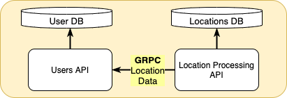

# Golang capstone project

## Project overview

### General concept

Design and develop a system to process user locations and provides the ability to search for clients by location (coordinates) and radius. Except that system should provide the ability to calculate the distance traveled by a person in some time range.

The system provides 3 REST endpoints for the backend clients with the following features:

1. Update current user location by the username.
2. Search for users in some location within the provided radius (with pagination).
3. Returns distance traveled by a person within some date/time range. Time range defaults to 1 day. 

    Examples: 

    - For 35.12314, 27.64532 → 39.12355, 27.64538 distance 445km
    - For 35.12314, 27.64532 → 39.12355, 27.64538 → 35.12314, 27.64532 distance is 890km

REST interface and contracts should be designed. 

The system should validate all input data, and respond with the proper status code and message. 

- username - 4-16 symbols (a-zA-Z0-9 symbols are acceptable)
- coordinates - fractional part of a number should be limited by the 8 signs, latitude and longitude should be validated by the regular rules. For example:
    - 35.12314, 27.64532
    - 39.12355, 27.64538
- dates - use ISO 8601 date format (2021-09-02T11:26:18+00:00)

### Implementation notices

The system should consist of 2 microservices:

1. Location management - for endpoints 1 and 2.
2. Location History management - for 3rd endpoint.

Main data flow:

1. User updates his current location
2. The current location is updated in the microservice 1
3. Microservice 1 sends the updated location to microservice 2 using Protobuf and GRPC
4. Microservice 2 prepares and persists the data

For microservices development, you could use any web framework or plain go. Multiple popular web frameworks are listed before.

- [https://github.com/gin-gonic/gin](https://github.com/gin-gonic/gin)
- [https://echo.labstack.com/](https://echo.labstack.com/)

The system should support the graceful shutdown, proper error handling, and logging.

Also, the ability to export Prometheus metrics would be a plus.

Any RDBMS or NoSQL solution be used as a data storage, depends on your habits.

### Testing

The system should be covered with unit test cases. Make sure that all important parts of the system are covered with the unit tests. For unit testing use table tests pattern on-demand to cover all needed conditions.

All endpoint contracts should be covered with functional test cases. For positive and negative cases. DB logic could be mocked.

Each endpoint should be covered by the integration tests as well. 

Integration tests should be included only when a specific tag is provided. Otherwise, only unit and functional test cases are run.

### Documentation

The project should be well documented, due to Golang guidelines.

Also, [README.md](http://readme.md) file should be present and contain comprehensive instruction for local environment setup

### Deployment (optional)

The developed application should be dockerized, for orchestration Kubernetes or Docker-compose could be used. 

The ability to run the application with a single command will be a plus. (consider using multi-stage builds).

Good Luck!!!
